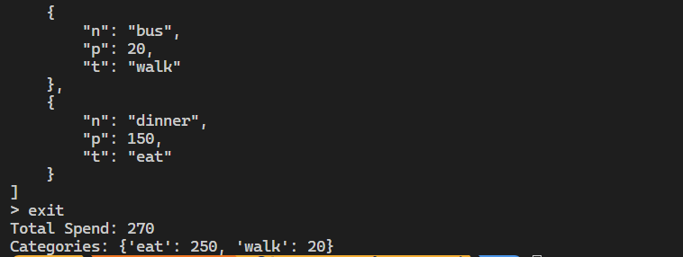

# 台科大資管 Python 實作作業作答區

---

## 基本資料

學號： B11xxxxxx
系級： 資管系大一
姓名： 王小明

## 一、 原始碼分析報告 (Static Analysis) (20%)

### 變數與邏輯對照表

| 原始變數名稱 | 代表意義 (Business Logic) | 建議修正名稱 |
|---|---|---|
| Q1 a (in p_proc) | 分解後的輸入字串 | split_text |
| Q2 b (in p_proc) | 轉換輸入字串，變成 dict | text_dict |
| Q3 cate_dict | 各類型分類的 dict | category_dict |

### 壞味道 (Code Smells) 診斷

請列出原程式碼中至少 5 個嚴重的設計問題，並說明為什麼不好

Q1： clear_all_danger 的危險性與命名不明確
問題：clear_all_danger 方法會清空 data_list 並刪除檔案，但名稱並未明確表達其破壞性操作，且沒有任何確認步驟。
為什麼不好：使用者可能意外執行此指令，導致資料永久遺失，且無法復原。

Q2： 缺乏輸入驗證與錯誤處理
問題：add_entry 方法中，對於 raw_data 的格式要求過於嚴格，且未提供詳細的錯誤訊息。p_proc 方法也未對輸入進行更嚴謹的檢查。
為什麼不好：使用者輸入錯誤時，程式僅回傳「Error in input format」，無法幫助使用者理解問題所在，降低使用體驗。

Q3： calculate_totals 方法的效率問題
問題：calculate_totals 方法中，對於 cate_dict 的計算使用了多次字典查找操作，且每次都重新計算。
為什麼不好：當資料量大時，效能會受到影響，應考慮使用更高效的資料結構或方法來處理。

Q4： 缺乏單元測試與錯誤處理覆蓋
問題：程式中對於檔案操作（如 save 和 load 方法）雖有基本的錯誤處理，但未進行充分的測試，且未考慮異常情況（如檔案被鎖定或無法存取）。
為什麼不好：在真實環境中，檔案操作可能失敗，缺乏完善的錯誤處理會導致程式崩潰或資料遺失。

Q5： 主程式邏輯與 Tracker 類別的耦合過高
問題：main 函式直接操作 Tracker 類別的多個方法，且未對命令進行模組化處理。
為什麼不好：這種設計使得程式難以擴展或測試，若需要新增功能或修改命令處理邏輯，會導致大量的程式碼變更。

> 可參考以下 Code Smells！

1. Line 3~4 全局變數（壞習慣 1：隨意使用全局變數）
2. Line 7,11 # 壞習慣 2：神祕的變數命名，完全看不懂 a, b, c 是什麼
3. Line 11 # 壞習慣 3：硬編碼的索引，且混雜了字串與型別轉換 # 這裡的邏輯是：項目/金額/類別
4. Line 16,18 # 壞習慣 4：極其低效的檔案寫法，每次存檔都重新開啟並用奇怪的格式
5. Line 25,26 # 壞習慣 5：手動解析混亂的格式，容易出錯
6. Line 36 # 壞習慣 6：完全沒有防錯機制，輸入空白或格式不對會直接 Crash
7. Line 39 # 壞習慣 7：在結束時才做複雜運算，且邏輯重複 # 統計分類邏輯寫得非常混亂
8. Line 51 # 壞習慣 8：字串切割邏輯脆弱
9. Line 60 # 壞習慣 9：排版混亂，沒有格式化輸出
10. Line 64 # 壞習慣 10：隱藏功能（未說明的後門）

---

## 二、 Vibe-Coding 協作紀錄 (30%)

請記錄你如何引導 GitHub Copilot 進行重構。

### 1. 關鍵 Prompt 紀錄

請貼出你對 AI 下達過最有效的 3 個 Prompt：

```log
Prompt A： 請將 clear_all_danger 方法改為更安全的版本，加入使用者確認步驟，並重新命名為更具描述性的名稱，例如 reset_data。

Prompt B： 請優化 calculate_totals 方法，減少重複計算，並確保在資料量大時效能更高。

Prompt C： 請改進 add_entry 方法的輸入驗證，讓錯誤訊息更具描述性，並提示使用者正確的輸入格式。
```

### 2. AI 錯誤處理

AI 在撰寫過程中是否有出錯？（例如：漏寫了某個功能、語法錯誤）你是如何發現並請它修正的？

- 發現的問題： AI 在初次重構時，漏掉了原本 exit 時需要顯示的「分類總額統計」功能。
- 修正的對話： 我告訴它：「在 exit 邏輯中，請加上一段迴圈，使用 dictionary 或 collections.Counter 重新統計各類別的金額總計後再退出。」
在撰寫 add_entry 方法時，可能因縮排錯誤導致程式無法執行。
如何發現：執行程式時，Python 會拋出 IndentationError 或 SyntaxError。
修正方式：檢查程式碼的縮排，並告訴 AI：「請修正 add_entry 方法的縮排錯誤，確保程式碼正確執行。」

---

## 三、 成果驗證與測試 (30%)

確保你的 `refined_tracker.py` 功能正確。

### 1. 測試結果截圖 (Terminal)

>> 

請貼上執行程式並輸入 show 後，顯示資料清單的截圖（或文字紀錄）。

### 2. 產出的資料檔案格式

請貼上重構後生成的 records.json 前幾行內容：

```json
[
    {"n": "breakfast", "p": 100, "t": "eat"}, 
    {"n": "bus", "p": 20, "t": "walk"}, 
    {"n": "dinner", "p": 150, "t": "eat"}
]
```

## 四、 Git 提交紀錄 (Commit History) (20%)

請執行 git log --oneline 並將最近的筆紀錄貼在此處，以證明你的開發流程。

```log
10a7ca3 (HEAD -> master) doc: Example answer
ebfcbd2 (origin/master, origin/HEAD) Init Commit
```

請附上你的 GitHub Repository 連結：

```log
https://github.com/fan9704/NTUST-Final
```
